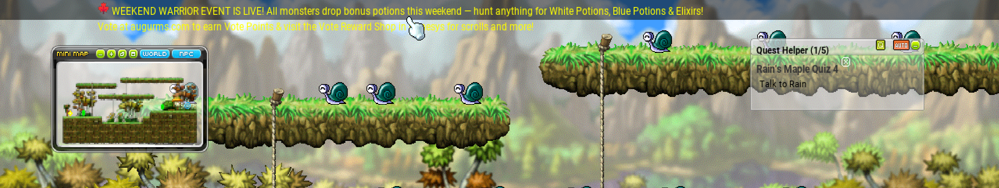
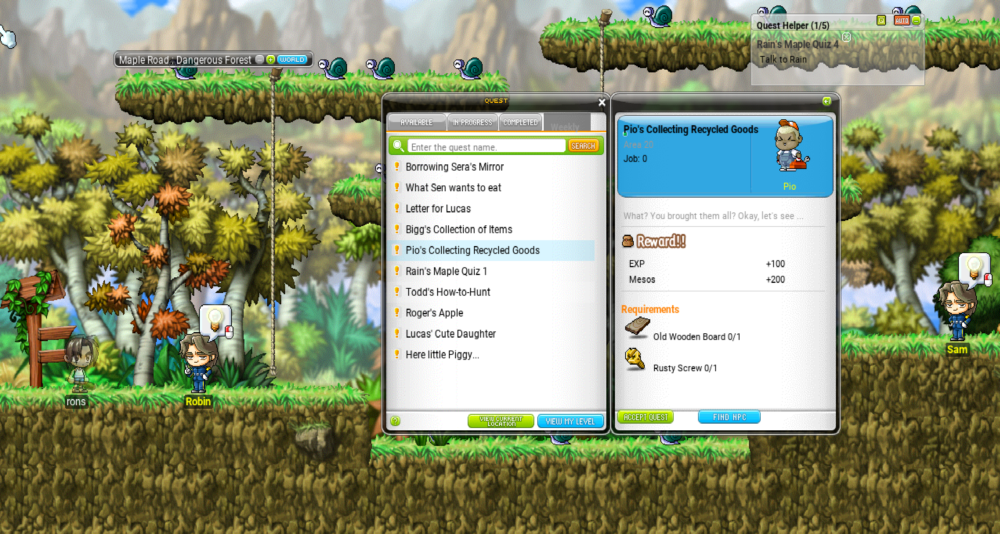

# OpenStory

A v83 MapleStory client for Cosmic/private servers. Forked from [HeavenClient](https://github.com/HeavenClient/HeavenClient).

**Status: Playable** — functional for gameplay, UI polish ongoing.

## Screenshots

### Status Bar - wip some ui meed fixing all the buttons work


### Emoji Support & Minimap


### Quest UI & NPC Quest Indicators


## Features

- Full v83 client connecting to Cosmic servers
- NX file-based assets, OpenGL rendering, GLFW windowing
- Login flow, character select, world/channel select, PIC entry
- Combat, skills, buffs, inventory, quests, NPCs, chat
- Storage, buddy list, skill macros, gamepad support
- Fullscreen, UI scaling, drag-and-drop windows

## Building

### Requirements
- Visual Studio 2022, Windows SDK, CMake 3.15+
- Dependencies: GLFW, GLEW, FreeType, Bass audio, NoLifeNx, Asio

### Build
```bash
cmake -S . -B build
cmake --build build --config Debug --target OpenStory
# Output: wz/OpenStory.exe
```

Place v83 NX files in the `wz/` directory.

## Configuration

Edit `Configuration.h` for defaults. A `Settings` file is generated after first run.

## Credits

- **Daniel Allendorf & Ryan Payton** -- Original [HeavenClient](https://github.com/HeavenClient/HeavenClient)
- **rdiol12** -- v83 Cosmic compatibility, UI systems, packet handlers

## Changelog

### Latest
- **Status Bar**: Rebuilt/polished status bar UI (HP/MP/EXP, character menu, chat controls). See screenshot above.
- **HP/MP/EXP flash animations**: The HP and MP gauges now play their animated low-resource overlay (`ani_hp_gauge` / `ani_mp_gauge`, plus the AB-job variant `ani_hp_gauge_ab`) when the bar drops below 30%. The EXP gauge and the notice icon pulse via alpha-cycled draws so status changes are visible at a glance.
- **NPC Dialog reliability**: Fixed intermittent "NPC chat UI doesn't open" bug. Root cause was `UIStateGame::remove` calling `unique_ptr::release()` (which leaks instead of freeing), leaving a null entry that wedged the next dialog. Handler also now force-removes stale dialog before opening a new one.
- **NPC Quest Indicator**: Tightened the "available quest" bulb above NPCs so it only shows for quests the player can actually pick up (filters out auto-start, auto-pre-complete, blocked, script-started, and quests with no area / no info entry).
- **In-game Channel Switcher**: Now draws only the real channels reported by the server for the current world, instead of hard-coding 20 slots. Login server list response populates a `ChannelLoadData` cache that `UIChannel` reads at construction.
- **TestingHandlers refactor**: Split the 1200+ line catch-all TestingHandlers into proper domain files: WeatherHandlers, ClockHandlers, FieldHandlers, UIControlHandlers, QuestHandlers, MiscHandlers. Moved login handlers to LoginHandlers, fame to PlayerInteractionHandlers, cash shop handlers to CashShopHandlers, hammer/vega to InventoryHandlers.
- **Fame/Defame fix**: Fixed fame buttons sending character ID instead of map object OID (server silently dropped the packet). Also fixed FameResponseHandler reading fame value as int instead of short.
- **UIClock NX sprites**: Clock UI now uses NX-based sprites instead of programmatic drawing.
- **Event System (Custom - WIP)**: Live event list UI using NX EventList sprites. Server sends events via EVENT_INFO (0xC3) packet, client requests via REQUEST_EVENT_INFO (0xF1). Shows event name, description, status (In Progress/Ended), item rewards with tooltips, and activates UIClock countdown for the first active event. *Custom protocol -- not supported by Cosmic server out of the box.*
- **UIOptionMenu overhaul**: Full settings panel with working sliders for BGM/SFX volume, HP/MP warning thresholds, graphics/effects quality. Slider percentage labels displayed. Menu always centered on screen.
- **HP/MP Warning overlays**: Screen flashes red when HP drops below threshold, blue for MP. Configurable via UIOptionMenu sliders.
- **Graphics/Effects Quality**: Slider controls limit concurrent effects and conditionally skip mists, foregrounds, environments, and weather based on quality setting.
- **System menu cleanup**: Reduced to 6 buttons, removed duplicates (MonsterLife, SystemOption, RoomChange). Game Option opens UIGameSettings, Option opens UIOptionMenu.
- **Minimap fixes**: Fixed simple mode breaking minimap open (uninitialized mapid), added side-edge resizing.
- **Monster Book UI -i i based this system on some pictures and videos i saw if you have a better reference open a ticket and i will adjust**: Card grid, detail overlay with animated mob sprite, drop items with tooltip on hover, and stats display. Click cards to view details, click sprite area to cycle stand/move/die animations. Tabs for category filtering and search. Home/card view works. *Note: Set Effect menu UI is still broken — layout and positioning need polish.*
- **Login Remember Me**: The "Save ID" checkbox on the login screen now actually remembers your login credentials between sessions.
- **Idle HP/MP regen (HEAL_OVER_TIME)**: Client now sends regen packets every ~10 seconds while idle. Formula: HP = level/5 + 2, MP = level/5 + INT/20 + 3. Mage Improving MP Recovery skill adds Level x SkillLevel / 10 extra MP. Chair sitting gives 3x bonus. Regen pauses during attacks, hit stun, invincibility, and death.
- **Heal floating numbers**: HP regen shows blue floating numbers above the character using the BasicEff heal number sprites.
- **Chair rendering and animation**: Fixed chair sprite rendering and sit animation when using inventory chair items.

### Custom Features (Not Cosmic-supported -- WIP)
| Feature | Status | Notes |
|---------|--------|-------|
| Event System | WIP | Custom EVENT_INFO/REQUEST_EVENT_INFO packets. Needs server-side handler in Cosmic. |
| HP/MP Warning | Working | Client-only, no server changes needed |
| Graphics/Effects Quality | Working | Client-only, no server changes needed |

### Recent Fixes
- **Quest complete effect**: Fixed QuestClear animation path (`Quest/clear` -> `QuestClear`) to match NX data; quest complete light pillar now shows from both SHOW_STATUS_INFO and QUEST_CLEAR handlers
- **Three Snails ammo check**: Skill now blocked if player lacks required snail shell items, preventing ghost MP drain
- **Packet handler fixes (Cosmic compatibility)**: Fixed critical packet format mismatches causing stream corruption:
  - SpawnMistHandler: added mist_type/ownerId fields, fixed box coords from short to int
  - MoveMonsterResponseHandler: fixed field types (bool/short/byte/byte)
  - HitReactorHandler: fixed stance read type and added missing fields
  - MonsterBookCardHandler: added missing full-flag byte
  - UpdateSkillHandler: added trailing byte consumption
  - CharInfoHandler: changed pet parsing from count-based to sentinel-based
  - MessengerHandler: remapped mode values to match Cosmic (chat=0x06, invite=0x03)
  - FamilyChartResultHandler: reads all 12 pedigree entry fields
  - FamilyInfoResultHandler: reads trailing entitlement data
  - SpawnReactorHandler: fixed trailing read from string to short
- **Skills buff and animation**: Now showing correctly
- **Skill sounds**: Fixed duplicate sample bug preventing skill sounds from playing
- **Quest system**: Completed quests now properly removed from active list; NPC quest bubbles refresh on state changes
- **Quest packets**: Full v83 quest handler coverage -- QUEST_CLEAR effect/sound, UPDATE_QUEST_INFO error sub-types (0x0A-0x0F), scripted quest action packets
- **EXP gain**: Fixed "not handled" message appearing for in-chat EXP notifications
- **SHOW_ITEM_GAIN_INCHAT**: Proper v83 mode switch for all 24 effect types
- **Notice button**: Changed from broken button to static sprite matching v83 client
- **Snow effect**: Added snow effect (WIP — needs reference for all MapleStory effects)
- **Quest Helper**: Rewritten to support multi-quest tracking (up to 5), collapsible entries, per-quest close button (BtDelete sprite), live item/mob progress from server quest data, auto-refresh on quest updates
- **Quest drag-and-drop**: Drag quests from the Quest Log into the Quest Helper to track them; drag tracked quests to reorder
- **Chat clipping**: Chat messages no longer render above the black chat background


## Quest Helper

Track up to 5 quests at once with live progress updates.

- **Add a quest**: Open the Quest Log (Q), go to In-Progress, click and drag a quest into the Quest Helper
- **Remove a quest**: Click the X button next to the quest name
- **Reorder**: Drag a quest name up or down within the Quest Helper
- **Collapse/Expand**: Click a quest name to toggle its requirements
- **Auto-track**: Click the AUTO button to fill the helper with your active quests

## License

GNU Affero General Public License v3. See [LICENSE](LICENSE).
