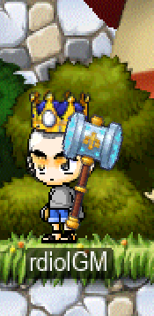
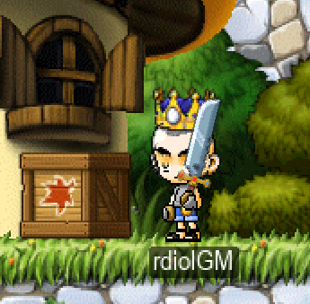
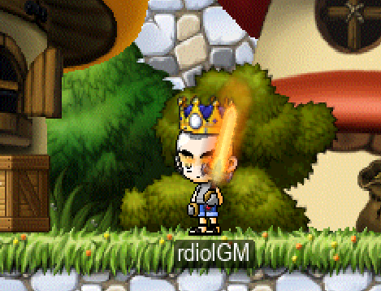

# OpenStory

A v83 MapleStory client for Cosmic/private servers. Forked from [HeavenClient](https://github.com/HeavenClient/HeavenClient).

**Status: Playable** — functional for gameplay, UI polish ongoing.

## Screenshots

### Status Bar


### Emoji Support & Minimap


### Quest UI & NPC Quest Indicators


## Features

- Full v83 client connecting to Cosmic servers
- NX file-based assets, OpenGL rendering, GLFW windowing
- Login flow, character select, world/channel select, PIC entry
- Combat, skills, buffs, inventory, quests, NPCs, chat
- Storage, buddy list, skill macros, gamepad support
- Distance-based (spatial) sound for world events
- Fullscreen, UI scaling, drag-and-drop windows

### Custom / experimental

Some features are client-side additions not supported by a stock Cosmic server:

| Feature | Status | Notes |
|---------|--------|-------|
| Event System | WIP | Custom `EVENT_INFO` / `REQUEST_EVENT_INFO` packets; needs a server-side handler |
| HP/MP Warning | Working | Client-only |
| Graphics/Effects Quality | Working | Client-only |
| Procedural Weapons | Working | AI-friendly one-image weapons — see below |
| Procedural Hats | WIP | Same idea for head-worn items |
| Procedural Armor | Not planned | Body clothing deforms per frame — stays authored |

## Procedural Weapons (AI-friendly item creation)

More and more private servers are turning to AI to generate new items, but authoring a
weapon the traditional way is heavy: a hand-drawn sprite for **every** stance and frame
(stand, walk, each swing/stab/shoot frame), each one pixel-aligned to the body. I built
this to help with that — so a new weapon needs just **one image and one anchor point**,
and the client poses it for every stance automatically. The goal is simply to make custom
item creation a lot lighter.

### How it works

A procedural weapon is a single **canonical bitmap** (blade up, handle down) plus a
**grip** point where the hand holds it. Instead of per-frame art, the client:

- anchors the **grip** to the character's hand each frame (`arm_position` from `BodyDrawInfo`),
- rotates the sprite about the grip by a per-`Weapon::Type` **motion profile** — a rest
  angle at idle, and the live forearm vector during swings/thrusts so the blade follows the arm,
- mirrors correctly when facing left.

The placement compensates for the engine rotating a sprite about its centre, so the grip
lands exactly on the hand (0 px error). A `tip` anchor marks the blade point (reach/effects).
Swing **afterimage** trails default per weapon type (`swordOL`, `spear`, `bow`, `gun`, …) with
no extra data, and optional per-weapon blade **glow** effects ride the same transform.

Net result: one picture per weapon, no per-stance frame art, no per-weapon hand-tuning.

### Building the WZ/NX files

Author each weapon as one image with anchors, then convert WZ → NX and drop it in `wz/`:

```
Character.wz/Weapon/0XXXXXXX.img
├─ info                     (islot, attack, attackSpeed, reqs — as normal)
└─ default/
   └─ weapon                <- the 96x96 canonical bitmap (blade up, handle down)
      ├─ origin  (0,0)
      ├─ z       "weapon"
      └─ map/
         ├─ grip  (48,80)    <- where the hand holds it (constant for every weapon)
         └─ tip   (48,Yt)    <- blade tip (per-weapon; top-centre of the art)
```

- Canonical canvas **96×96**, blade straight up, handle centred at the bottom, `grip` at a
  fixed **(48,80)**. Generate every weapon against that template and `grip` is a stamped
  constant — the client's math never moves.
- A procedural weapon has **only** `default/weapon` + `info` — **no stance groups**.
- Type (rest pose, motion profile, afterimage) is derived from the item-ID prefix
  (130 = 1H sword, 143 = spear, 145 = bow, 149 = gun, …) — no extra field to author.
- Convert with any WZ→NX tool (the client reads NX via NoLifeNx).

### Original items are unaffected

The procedural path is **opt-in by format**. It activates only for a weapon that has a
`default/weapon` bitmap **and no** authored stance nodes (`stand1`). Every stock/vanilla
weapon keeps its full authored stance set and renders on the original path, unchanged.
Procedural and authored weapons can live side-by-side in the same `Character.nx` — each is
detected per item — so adding procedural weapons never touches the existing item set.

### Hats & armor

The one-image approach only works for **rigid** equipment. **Hats** ride the head and are a
natural next step (a single image anchored to the head's `brow`) — **work in progress**.
**Body armor** (top/bottom/overall/gloves/shoes) **deforms with the body** — the torso bends,
arms swing, legs walk — so a single picture can't represent it; armor stays on the traditional
authored, per-frame path.

some example that was created purly by ai





with glow effect




## Building

### Requirements
- Visual Studio 2022+, Windows SDK, CMake 3.15+
- Dependencies: GLFW, GLEW, FreeType, Bass audio, NoLifeNx, Asio

### Build
```bash
cmake -S . -B build
cmake --build build --config Debug --target OpenStory
# Output: wz/OpenStory.exe
```

Place v83 NX files in the `wz/` directory.

## Configuration

Edit `Configuration.h` for defaults. A `Settings` file is generated after the first run.

First run: enable **Save Login** on the login screen, close the client, then edit the
generated `Settings` file to set `VSync = false` and `Fullscreen = true`.

## Quest Helper

Track up to 5 quests at once with live progress updates.

- **Add a quest**: Open the Quest Log (Q), go to In-Progress, then drag a quest into the Quest Helper (or double-click an opened quest)
- **Remove a quest**: Click the X button next to the quest name
- **Reorder**: Drag a quest name up or down within the Quest Helper
- **Collapse/Expand**: Click a quest name to toggle its requirements
- **Auto-track**: Click the AUTO button to fill the helper with your active quests

## Credits

- **Daniel Allendorf & Ryan Payton** — Original [HeavenClient](https://github.com/HeavenClient/HeavenClient)
- **rdiol12** — v83 Cosmic compatibility, UI systems, packet handlers

## License

GNU Affero General Public License v3. See [LICENSE](LICENSE).
